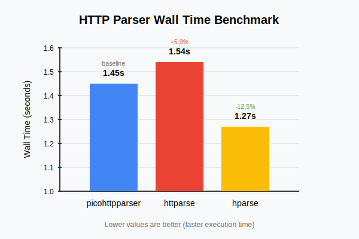

# hparse


Fast HTTP/1.1 & HTTP/1.0 parser. Powered by Zig ⚡

## Features

* Cross-platform SIMD vectorization through Zig's `@Vector`,
* Streaming first; can be easily integrated to event loops,
* Handles partial requests,
* Never allocates and never copies.
* Similar API to picohttpparser; can be swapped in smoothly.

## Are We Fast?

Benchmarks can be found under [`bench/`](https://github.com/nikneym/hparse/tree/main/bench) folder, they can either be run with [hyperfine](https://github.com/sharkdp/hyperfine) or [POOP](https://github.com/andrewrk/poop).

Here are the comparison of 3 parser libraries (hparse, httparse and picohttpparser) via POOP, visualized by Claude 4 Sonnet.



```
Benchmark 1 (35 runs): ./picohttpparser/picohttpparser
  measurement          mean ± σ            min … max           outliers         delta
  wall_time          1.45s  ± 8.78ms    1.44s  … 1.49s           1 ( 3%)        0%
  peak_rss           1.20MB ± 11.0KB    1.14MB … 1.20MB          1 ( 3%)        0%
  cpu_cycles         6.16G  ± 30.3M     6.13G  … 6.30G           2 ( 6%)        0%
  instructions       34.7G  ±  141      34.7G  … 34.7G           1 ( 3%)        0%
  cache_references   11.1K  ± 3.30K     7.47K  … 20.5K           1 ( 3%)        0%
  cache_misses       6.08K  ± 1.14K     3.71K  … 9.26K           2 ( 6%)        0%
  branch_misses      13.2K  ± 3.16K     10.0K  … 24.1K           3 ( 9%)        0%
Benchmark 2 (33 runs): ./bench-httparse/target/release/bench-httparse
  measurement          mean ± σ            min … max           outliers         delta
  wall_time          1.54s  ± 33.8ms    1.51s  … 1.66s           1 ( 3%)        💩+  5.9% ±  0.8%
  peak_rss           1.86MB ± 28.2KB    1.79MB … 1.92MB         12 (36%)        💩+ 54.6% ±  0.9%
  cpu_cycles         6.53G  ±  140M     6.43G  … 7.03G           1 ( 3%)        💩+  6.1% ±  0.8%
  instructions       25.2G  ±  294      25.2G  … 25.2G           0 ( 0%)        ⚡- 27.4% ±  0.0%
  cache_references   17.0K  ± 3.58K     12.5K  … 26.9K           2 ( 6%)        💩+ 53.8% ± 15.1%
  cache_misses       9.16K  ± 1.58K     6.95K  … 14.0K           2 ( 6%)        💩+ 50.7% ± 11.0%
  branch_misses      12.4K  ± 1.23K     10.4K  … 15.4K           0 ( 0%)          -  5.9% ±  8.9%
Benchmark 3 (40 runs): ./hparse/zig-out/bin/hparse
  measurement          mean ± σ            min … max           outliers         delta
  wall_time          1.27s  ± 4.63ms    1.26s  … 1.28s           0 ( 0%)        ⚡- 12.5% ±  0.2%
  peak_rss            184KB ±    0       184KB …  184KB          0 ( 0%)        ⚡- 84.6% ±  0.3%
  cpu_cycles         5.38G  ± 1.81M     5.38G  … 5.39G           3 ( 8%)        ⚡- 12.6% ±  0.2%
  instructions       8.01G  ±  164      8.01G  … 8.01G           0 ( 0%)        ⚡- 76.9% ±  0.0%
  cache_references   1.87K  ± 1.24K      617   … 5.91K           3 ( 8%)        ⚡- 83.1% ± 10.1%
  cache_misses       1.08K  ±  735       469   … 3.45K           6 (15%)        ⚡- 82.2% ±  7.2%
  branch_misses      6.51K  ±  776      5.36K  … 8.71K           4 (10%)        ⚡- 50.6% ±  7.8%
```

## Usage

```zig
const buffer: []const u8 = "GET /hello-world HTTP/1.1\r\nHost: localhost\r\nConnection: keep-alive\r\n\r\n";

// initialize with default values
var method: Method = .unknown;
var path: ?[]const u8 = null;
var http_version: Version = .@"1.0";
var headers: [32]Header = undefined;
var header_count: usize = 0;

// parse the request
_ = try hparse.parseRequest(buffer[0..], &method, &path, &http_version, &headers, &header_count);
```

## Installation

Install via Zig package manager (Copy the full SHA of latest commit hash from GitHub):

```sh
zig fetch --save https://github.com/nikneym/hparse/archive/<latest-commit-hash>.tar.gz
```

In your `build` function at `build.zig`, make sure your build step and source files are aware of the module:

```zig
const dep_opts = .{ .target = target, .optimize = optimize };

const hparse_dep = b.dependency("hparse", dep_opts);
const hparse_module = hparse_dep.module("hparse");

exe_mod.addImport("hparse", hparse_module);
```

## Acknowledgements

This project wouldn't be possible without these other projects and posts:

* [h2o/picohttpparser](https://github.com/h2o/picohttpparser)
* [seanmonstar/httparse](https://github.com/seanmonstar/httparse)
* [SIMD with Zig by Karl Seguin](https://www.openmymind.net/SIMD-With-Zig/)
* [SWAR explained: parsing eight digits by Daniel Lemire](https://lemire.me/blog/2022/01/21/swar-explained-parsing-eight-digits/)
* [Bit Twiddling Hacks by Sean Eron Anderson](https://graphics.stanford.edu/~seander/bithacks.html)

## License

MIT.
